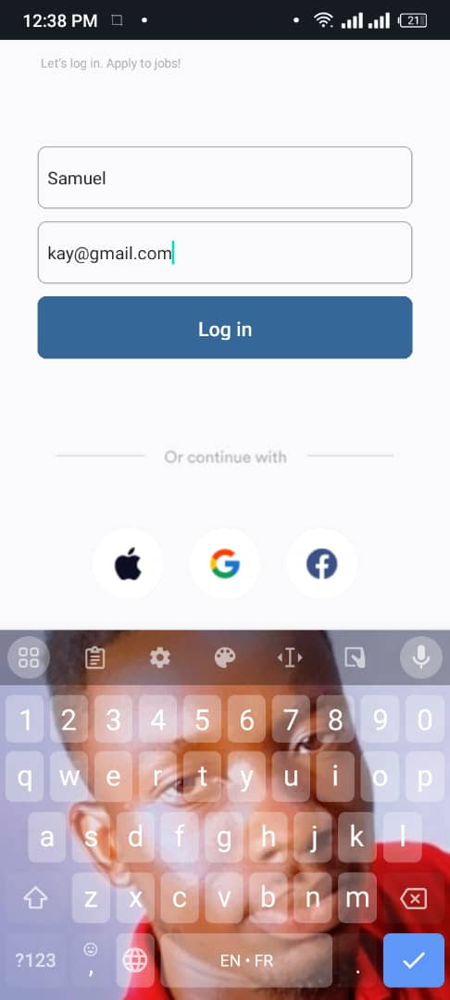
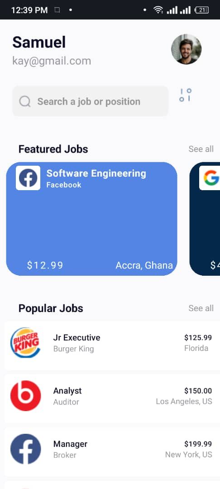
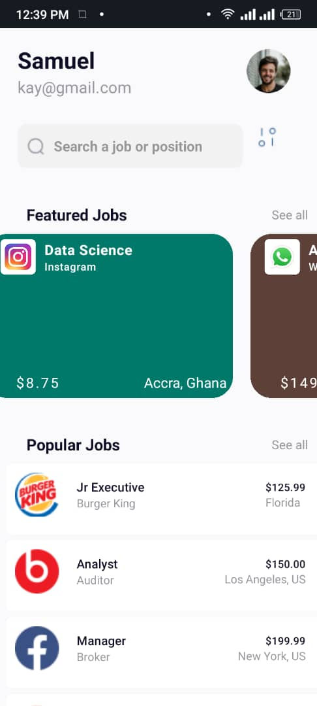
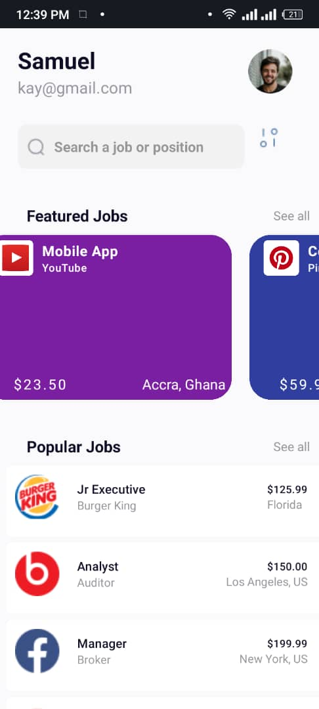
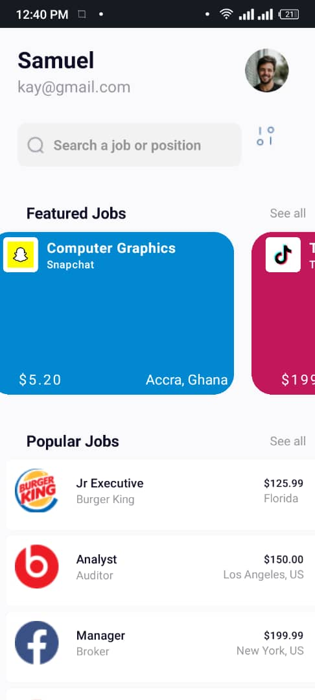

# Job Finder App

## Overview
The Job Finder App is a simple and efficient application designed to help users find popular and featured jobs. It includes a login screen that passes user details to the home screen, where the details are displayed. The app features custom components for job cards, which are displayed in both popular and featured job sections.

## Components
-Featured job
-Popular job

### Login Screen
- **Description**: The login screen is the entry point of the application where users input their name and email.
- **Usage**: Users enter their name and email, then press the login button. Upon pressing login, the user is navigated to the home screen, and their details are passed along.
- **Screenshot**:  
  
    
  

### Home Screen
- **Description**: The home screen displays the user's name and email and showcases the popular and featured job cards.
- **Usage**: After logging in, users are taken to the home screen where they can see their details at the top and browse through the job cards.
- **Screenshot**:  
    
  
### Job Card Component
- **Props**:
  - `title`: The title of the job.
  - `company`: The company offering the job.
  - `location`: The job location.
  - `salary`: The salary range for the job.

### Featured Jobs Section
- **Description**: Displays 8 different job cards of featured jobs.
- **Usage**: Utilizes the Job Card Component to display job details.

- **Screenshot**:  
  
  
  

### Popular Jobs Section
- **Description**: Displays 8 different job cards of popular jobs.
- **Usage**: Utilizes the Job Card Component to display job details.

- **Screenshot**:  
    
  
  

## Custom Components
Custom components are used throughout the application to maintain a consistent design and enhance reusability. Each job card is created using the custom Job Card Component, ensuring uniformity across the popular and featured job sections.

## Installation and Setup
1. Clone the repository:
   ```bash
   git clone https://github.com/samuelGyasiFordjour/rn-assignment4-11053488.git
   ```
2. Navigate to the project directory:
   ```bash
   cd rn-assignment4-11053488
   ```
3. Install the dependencies:
   ```bash
   npm install
   ```
4. Start the application:
   ```bash
   npm start
   ```

# Student ID: 11053488